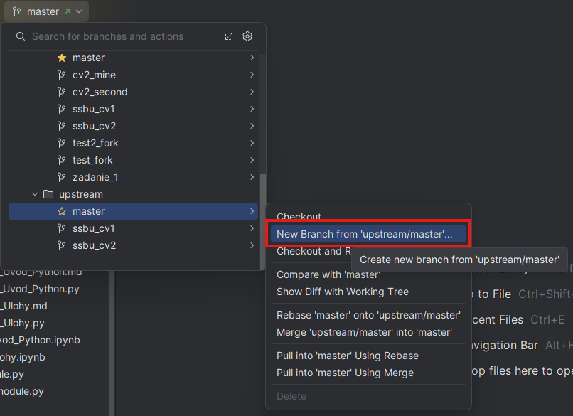
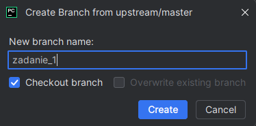
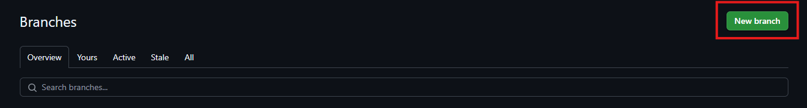
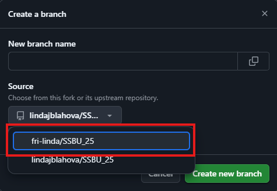
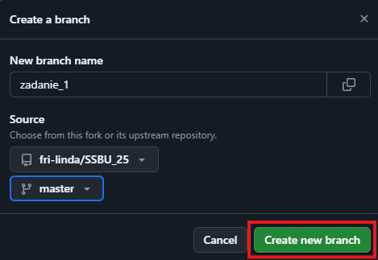
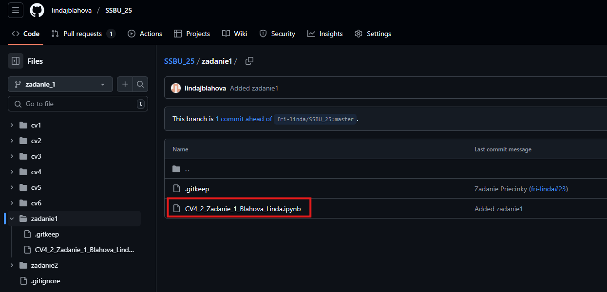
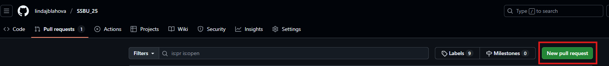
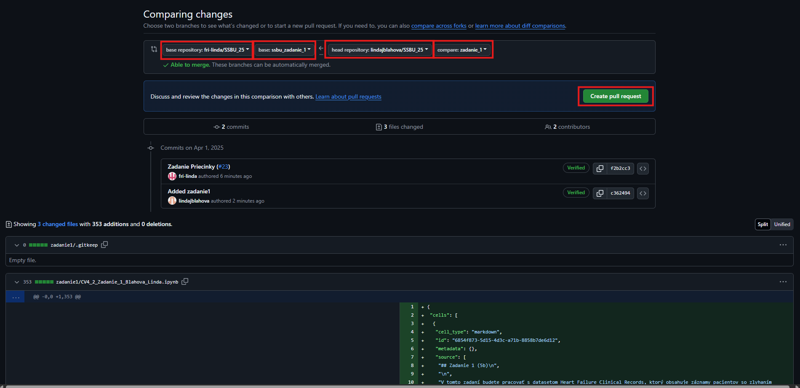
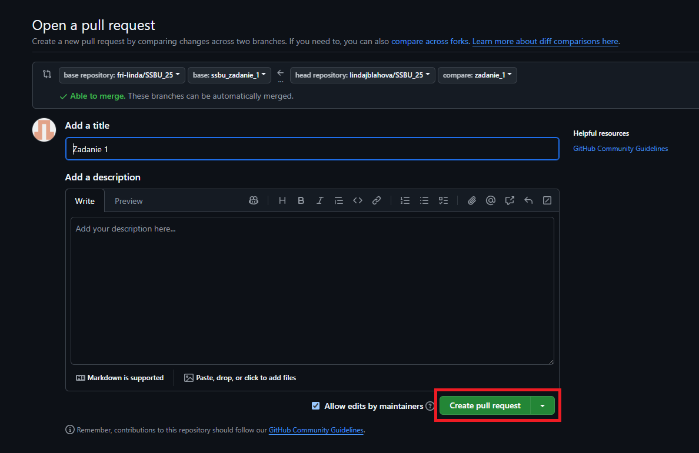
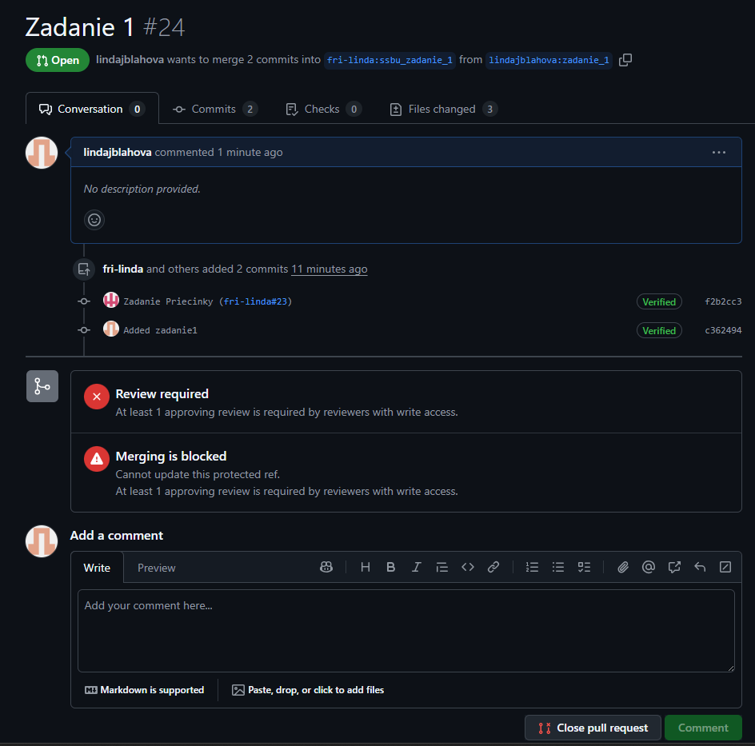

# SSBU_25
Softvérové Spracovanie Biomedicínskych Údajov 

## Odovzdanie Zadaní

Všetky zadania budete odovzdávať cez Github repozitár, preto si ho na začiatku **synchronizujte**. 
(Po synchronizácii by ste v repozitrári mali vidieť priečinky `zadanie1` a `zadanie2`.

**Pri odovzdávaní, je dôležité, aby ste do upstream repozitára (fri-linda/SSBU) odoslali vždy iba zmeny, ktoré súvisia 
s daným zadaním. (napr. súbor Zadanie1.ipynb, nie všetky svoje zmeny z predošlých cvičení)**

### Postup pre odovzdanie zadaní

Aby ste do upstream repozitára odoslali zmeny, ktoré súvisia s daným zadaním, je potrebné vytvoriť novú vetvu, 
ktorá bude výchádzať z vetvy upstream/master, pridať do nej zmeny iba pre dané zadanie a vytvoriť Pull Request.

---

## 1. Vytvorenie vetvy z upstream 

Vytvoriť vetvu ktorá bude vychádza5 z upstream repozitára môžete cez GitHub web, PyCharm, alebo cez príkazový riadok (CMD).

### Možnosť 1: Vytvorenie vetvy z upstream cez PyCharm

1. **Vytvorenie novej vetvy:**
   - Rozkliknite vetvy v repozitári (v ľavom hornom rohu).
   - Nájdite Remote -> Upstream -> master > `New branch from upstream/master`.
   - Zadajte názov vetvy (napr. `zadanie_1`) a potvrďte.

 
 

2. Pokračujte v procese spôsobom ako ste zvyknutí - do vytvorenej vetvy pridajte súbory s riešením úlohy (pravdepodobne 
ich budete musieť skopírovať z inej vetvy, ak ste ich už dali na git), commitnite zmeny a pushnite do repozitára.

---

### Možnosť 2: Vytvorenie vetvy z upstream cez GitHub web

1. **Prihlásenie a synchronizácia:**
   - Prihláste sa do svojho GitHub účtu a prejdite do svojho forknutého repozitára.
   - Ak váš fork nie je aktuálny, synchronizujte ho (**Sync upstream** a **Update**)

2. **Vytvorenie novej vetvy:**
   - Otvorte zobrazenie vetiev (napr. "Branch: master") a tlačidlom **New branch** vytvoríte novú vetvu.
   - Pri vytváraní vetvy zvoľte **Upstream repozitár** `fri-linda/SSBU` a **vetvu** `master`.
   - Zadajte názov vetvy, napr. `zadanie_1`, a potvrďte. Vetva bude založená na aktuálnom stave upstream `master`, 
   čo zabezpečí, že žiadne z Vašich zmien z cvičení nebudú v tejto vetve.
   
 
 
 
   
3. Pokračujte v procese spôsobom ako ste zvyknutí - do vytvorenej vetvy pridajte súbory s riešením úlohy (pravdepodobne 
ich budete musieť skopírovať z inej vetvy, ak ste ich už dali na git), 
commitnite zmeny a pushnite do repozitára. (Buď priamo cez web interface, cez PyCharm alebo cez príkazový riadok. 
Ak použijete PyCharm alebo príkazový riadok, nezabudnite urobiť update lokálneho projektu)

---

### Možnosť 3: Vytvorenie vetvy z upstream cez príkazový riadok (CMD)

Skopírujte si vaše vypracované zadanie z pôvodnej vetvy mimo repozitár, aby ste ho mohli dať do vetvy vychádzajúcej z upstream repozitára.
1. **Nastavenie upstream (ak ešte nie je nastavený):**
   - Otvorte terminál v adresári vášho forknutého repozitára.
   - Skontrolujte nastavené vzdialené repozitáre:
     ```bash
     git remote -v
     ```
   - Ak upstream nie je pridaný, pridajte ho:
     ```bash
     git remote add upstream https://github.com/fri-linda/SSBU_25
     ```

2. **Synchronizácia s upstream:**
   - Stiahnite si najnovšie zmeny:
     ```bash
     git fetch upstream
     ```

3. **Vytvorenie novej vetvy:**
   - Vytvorte a prepnete sa na novú vetvu založenú na upstream `master`:
     ```bash
     git checkout -b zadanie_1 upstream/master
     ```

---

## 4. Pridanie a commitovanie riešenia zadania

Súbor/priečinok s riešením pomenujte nasledovne: [pôvodný_názov_**priezvisko_meno**].prípona (napr. `Zadanie1_Blahova_Linda.ipynb`).

1. Súbor vložte do zadaného priečinka **priamo vo Vašom repozitári**:

Zadanie 1: `zadanie1/Zadanie1__priezvisko_meno.ipynb` (stačí odovzdať Jupyter Notebook)

Zadanie 2: `zadanie2/machine_learning_priezvisko_meno/` (Odovzdajte celý priečinok s kódom, kde zahrniete aj .md súbor s odpoveďami na otázky)

2. Súbor cez commit a push odošlite do Vášho remote repozitára (do rovnako pomenovanej vetvy).



3. Z vašej vetvy vytvorte Pull Request **do vetvy pre dané zadanie** upstream repozitára.

 

 



