# SSBU CV1: Úvod

## Inštalácia potrebných nástrojov

### Inštalácia Python

Potrebné stiahnuť inštalačný súbor - www.python.org/downloads/

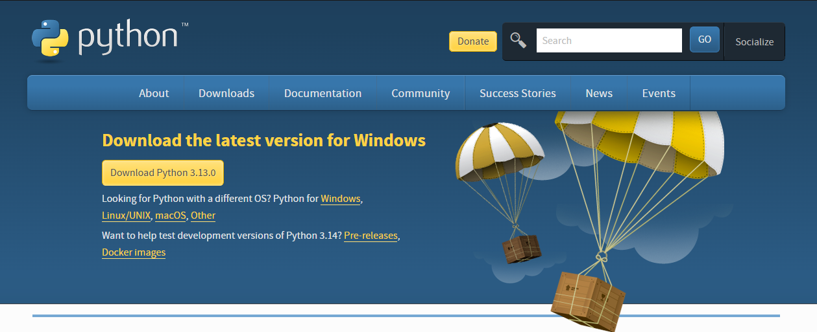 

**Pri inštalácii vyberte možnosti:**
- Use admin privileges when installing py.exe
- Add python.exe to path
- pip (v Optional Features)
- Associate files with Python (v Advanced Options)
- Create shortcuts for installed applications (v Advanced Options)
- Add Python to environment variables (v Advanced Options)

 
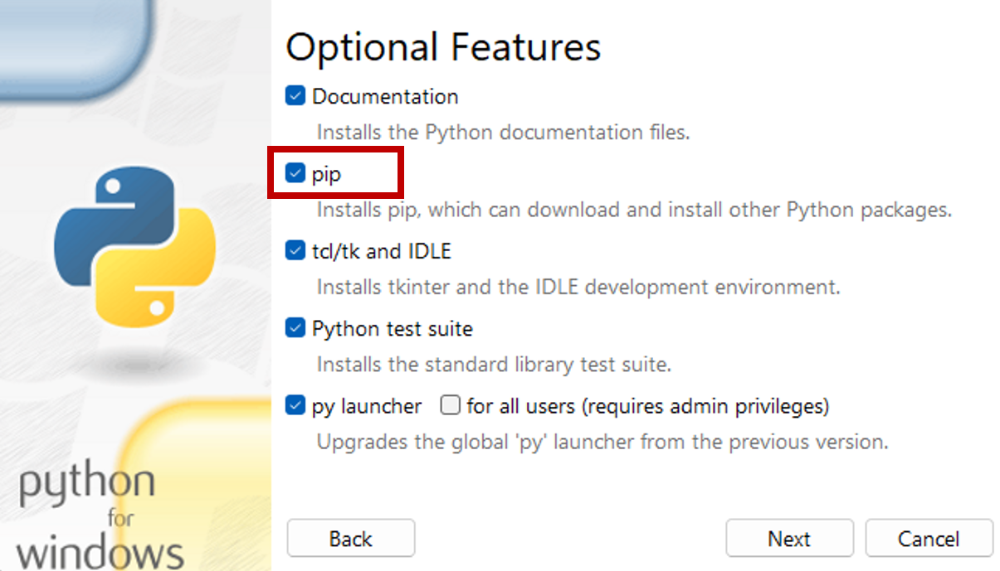 
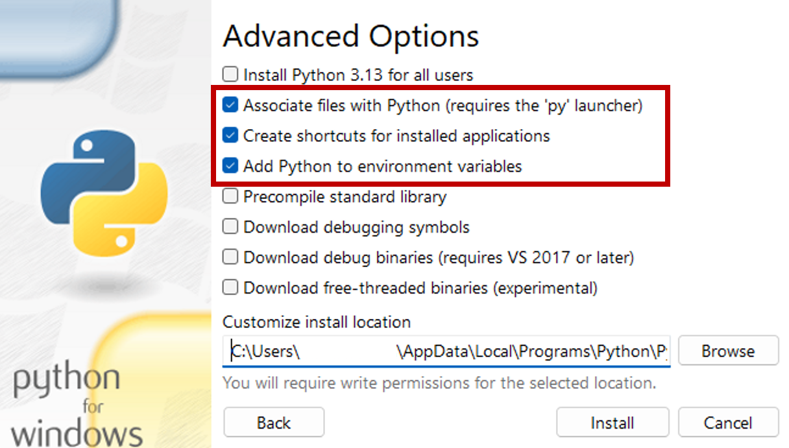

V príkazovom riadku:
- Overenie nainštalovanej verzie Pythonu:
`python -V`

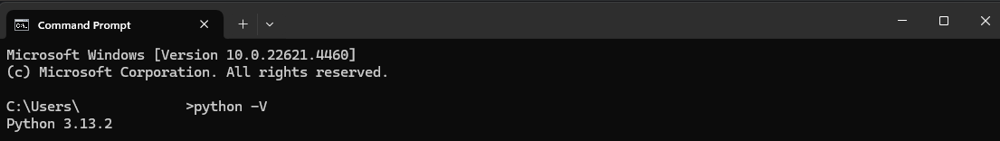

- Overenie nainštalovanej verzie Pip:
`pip -V`

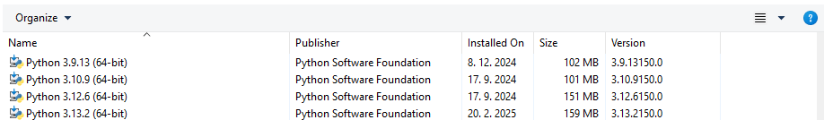

----

### Inštalácia PyCharm

- Inštalácia Pycharm **Professional** verzie (dostupná so študentskou JetBrains licenciou)

**Pri inštalácii vyberte možnosti:**
- Add "Open Folder as Project"
- Add associations for .py files
- Add "bin" folder to the PATH

Po inštalácii IDE je potrebné reštartovať počítač.

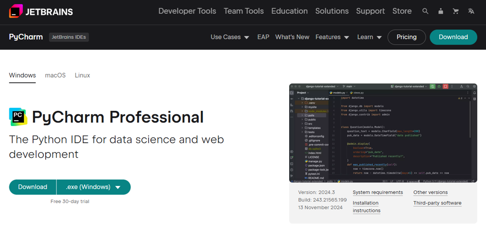
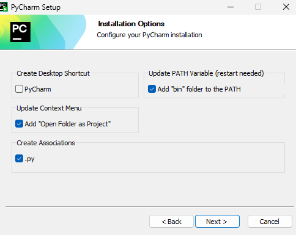
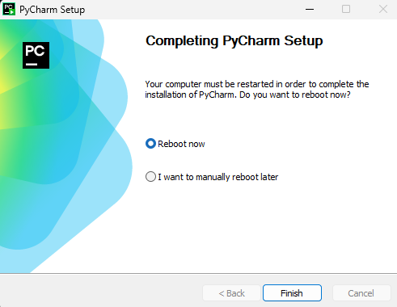

### Vytvorenie projektu
Vytvorenie projektu je možné pomocou tlačidla **Create New Project** pre vytvorenie prázdneho projektu, 
tlačidlom **Open** pre otvorenie existujúceho projektu, prípadne tlačidlom **Clone Repository** 
pre stiahnutie a otvorenie projektu z repozitára uloženého vo verzionovacom systéme (napr. Git).

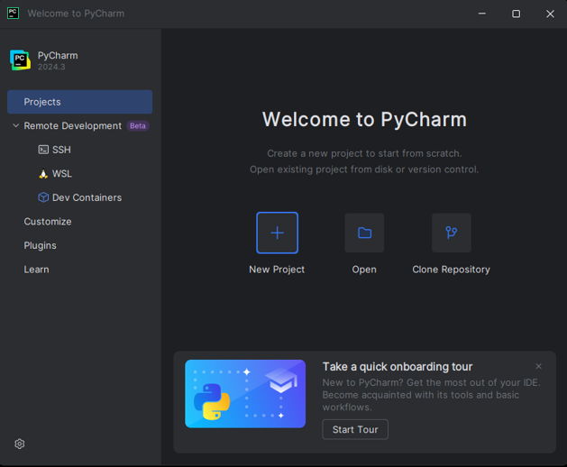

Pri vytváraní projektu je potrebné zvoliť adresár, kde bude projekt uložený,
vybrať možnosť **Create a welcome skript**, ktorá vytvorí súbor main.py s jednoduchým predpripraveným kódom,
a zvoliť interpreter Pythonu, ktorý sa má použiť. (V našom prípade virtual environment)

#### Vytvorenie Virtuálneho Prostredia
Pri zvolení interpretera vyberte možnosť **Project venv** (virtual environment), 
zvoľte nainštalovanú verziu jazyka Python, ktorú chcete použiť a vytvorte projekt.

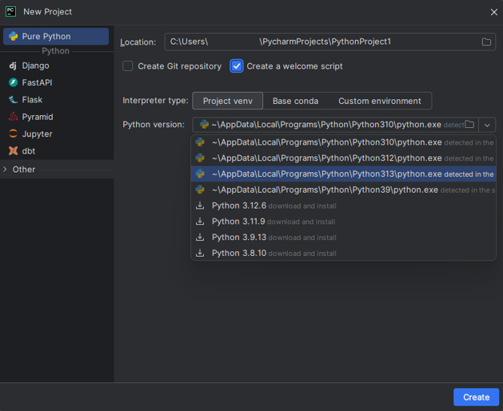

### Overenie spustenia .py skriptu
Overte úspešnú inštaláciu, vytvorenie virtuálneho prostredia a komunikáciu s jazykom Python 
pomocou spustenia súboru main.py. 
(Použite spustenie aktuálneho súboru, prípadne vytvorte vlastnú konfiguráciu 
pre súbor main.py.)

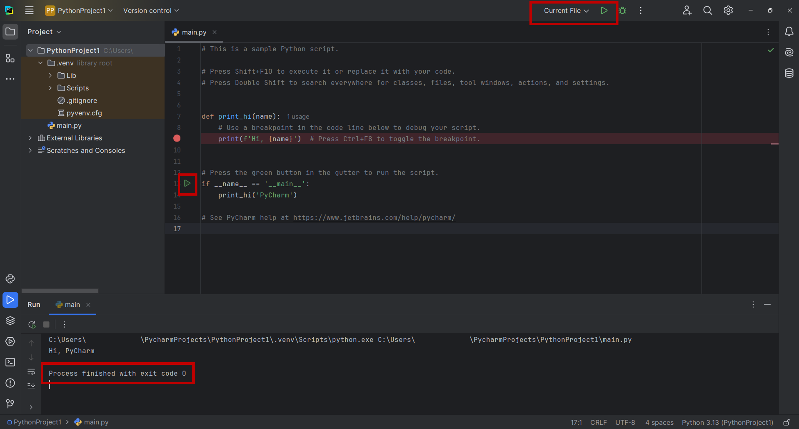

----

### Fork Git repozitára

##### Fork

- Na Githube nájdete repozitár https://github.com/fri-linda/SSBU_25
- Na pravej strane je tlačidlo Fork - fork vytvorí kópiu repozitára na vašom Github účte a prepojí ju s pôvodným repozitárom.

- **Odznačte** checkbox "Copy the master branch only"

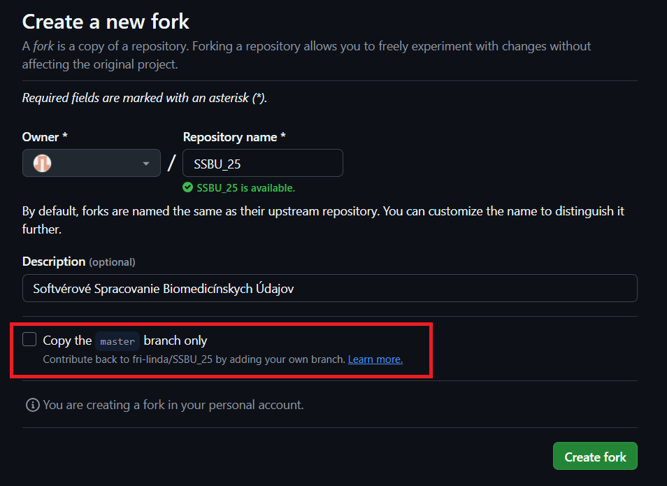

- Overte vytvorenie kópie repozitára na vašom Github účte.

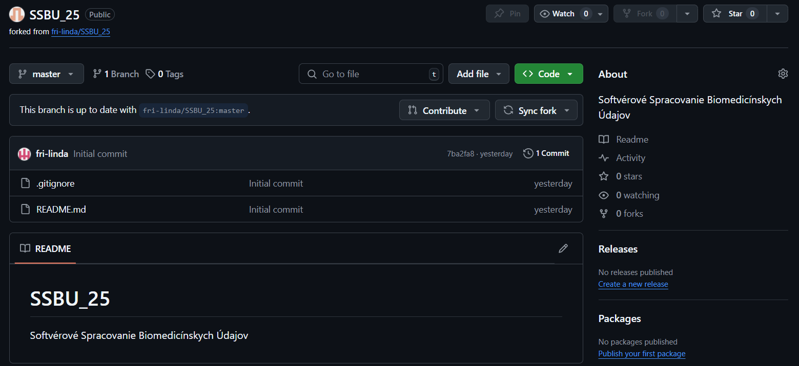

- Pomocou tlačidla **Sync fork** si pravidelne synchronizujete zmeny v pôvodnom repozitári s vašim repozitárom

- 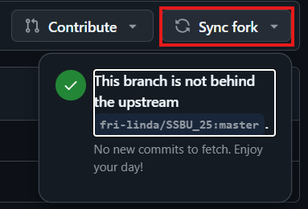

Nakoniec je ešte potrebný clone svojho repozitára.

##### Clone Repozitára
V príkazovom riadku:

`git clone [[link na repozitár]]`

Checkout na inú vetvu:

`git checkout [[názov vetvy]]`

Pre vytvorenie novej vetvy a checkout na ňu použite prepínač `-b`:

`git checkout -b [[názov vetvy]]`

##### Nahranie vlastných zmien do repozitára
Môžete podľa preferencií použiť nástroj pre prácu s repozitáron 
(napr. Sourcetree, Git extensions,..),
prípadne použiť priamo príkazy v príkazovom riadku:

- Vytvorenie nového súboru alebo editácia existujúceho súboru
- Pridanie súboru do stage pomocou príkazu `git add [[názov súboru]]`
- Commit zmien pomocou príkazu `git commit -m [[popis zmien]]`
(prepínač **-m** slúži na pridanie popisu (message) commitu)
- Nahranie zmien do remote repozitára pomocou príkazu `git push origin [[vetva]]`

##### (_Troubleshoot_) Vytvorenie prístupového tokenu pre Git 
V prípade,že nahrávanie zmien do remote repozitára bude zamietnuté, je potrebná autentifikácia používateľa.
Najjednoduchší spôsob je autentifikácia pomocou prehliadača, kde v prehliadači s prihláseným používateľom
potvrdíte prístup z príkazového riadku k repozitáru. 
Alternatívou je vytvorenie ssh kľúče, prípadne vytvorenie prístupového tokenu pre Git.

[Návod pre vytvorenie SSH kľúča pre Git - Windows](https://www.theserverside.com/blog/Coffee-Talk-Java-News-Stories-and-Opinions/GitHub-SSH-Windows-Example)

[Návod pre vytvorenie SSH kľúča pre Git - ostatné operačné systémy - vytvorenie kľúča](https://docs.github.com/en/authentication/connecting-to-github-with-ssh/generating-a-new-ssh-key-and-adding-it-to-the-ssh-agent)

[Návod pre vytvorenie SSH kľúča pre Git - ostatné operačné systémy - pridanie kľúča](https://docs.github.com/en/authentication/connecting-to-github-with-ssh/adding-a-new-ssh-key-to-your-github-account)

[Návod pre vytvorenie prístupového tokenu pre Git](https://www.theserverside.com/blog/Coffee-Talk-Java-News-Stories-and-Opinions/How-to-create-a-GitHub-Personal-Access-Token-example)