# SSBU CV3: Git Workflow

Návod na prácu s Gitom vo vlastnom forknutom repozitári.

Generický workflow:
1. **Práca v lokálnom repozitári (napr. pre konkrétne cvičenie)**
2. **Nahrávanie zmien na GitHub do konkrétnej vetvy + Vytvorenie pull requestu pre merge do hlavnej vetvy vo vlastnom repozitári**
3. **Synchronizácia s hlavným repozitárom so zachovaním vlastných zmien**
4. **Stiahnutie všetkých zmien do lokálneho repozitára**

Použitie troch prístupov: **PyCharm, GitHub web interface a príkazový riadok**

---

## **1. Práca na vlastnej vetve**

Pred odoslaním zmien do vlastného repozitára na Githube (origin) je vhodné pracovať na samostatnej vetve, aby sa predišlo konfliktom.

### **Príkazový riadok**
```sh
# Vytvorenie a prepnutie na novú vetvu
git checkout -b [názov_vetvy]
```

### **PyCharm**
1. Otvorte projekt v PyCharme.
2. V ľavom hornom rohu kliknite na aktuálnu vetvu a vyberte **New Branch**.
3. Zadajte názov novej vetvy a potvrďte.

### **GitHub web interface**
1. Prejdite do vášho forku na GitHube.
2. Kliknite na **Master** → **View all branches** → **New Branch**.

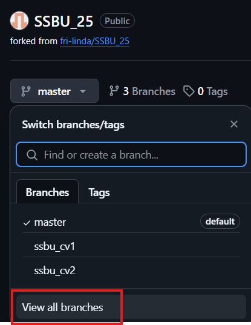

3. Pomenujte vetvu a vytvorte ju.

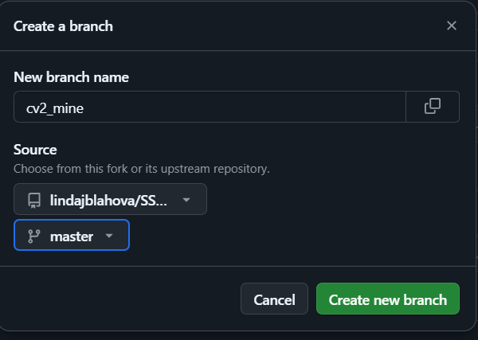

---

## **2. Nahrávanie zmien do vzdialeného repozitára**

Po vykonaní zmien je potrebné ich uložiť a odoslať na GitHub.

### **Príkazový riadok**
```sh
# Pridanie zmien (Local Stage)
git add [názov_súboru]

# Commitovanie zmien (Local Commit)
git commit -m "[commit_message]"

# Push do forknutého repozitára (Forked Remote Repository = orign)
git push origin [názov_vetvy]
```

### **PyCharm**
1. **Názov vetvy** → **Commit**
2. Vyberte súbory na commit, napíšte popis a kliknite **Commit & Push**.
3. Vyberte svoj repozitár na Githube a potvrďte.

### **GitHub web interface**
1. Prejdite na svoj fork.
2. Kliknite na **Add file** → **Upload files**.

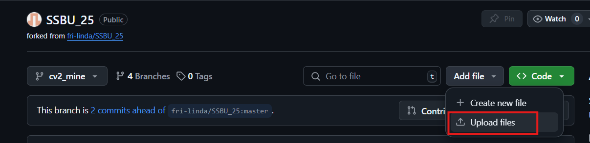

4. Nahrajte zmenené súbory a kliknite na **Commit changes**.

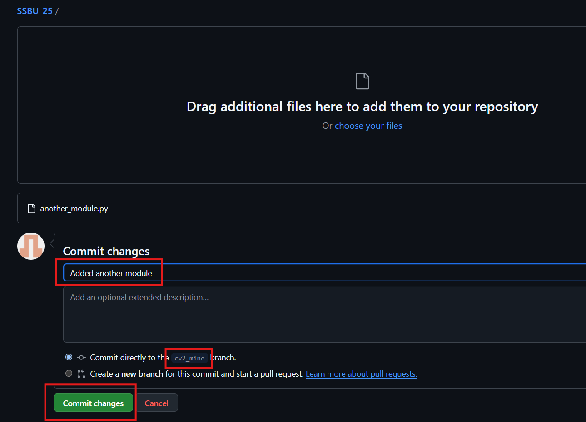


### **2.1. Vytvorenie pull requestu**

### **GitHub web interface** (odporúčaný spôsob)
1. Prejdite do vášho forku na GitHube.
2. Kliknite na **Pull Requests** → **New Pull Request** alebo vyberte **Compare & pull request**.

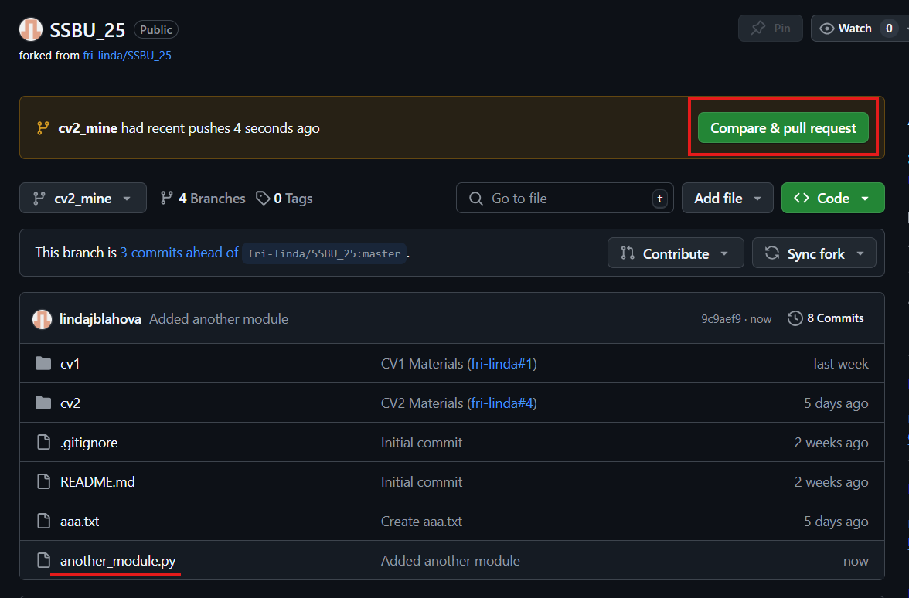

3. Vyberte porovnanie medzi `master` a `moja_vetva` v svojom repozitári.

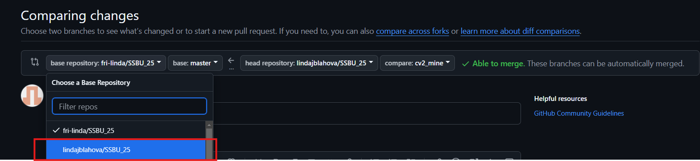

4. Kliknite na **Create Pull Request** a pridajte popis zmien.

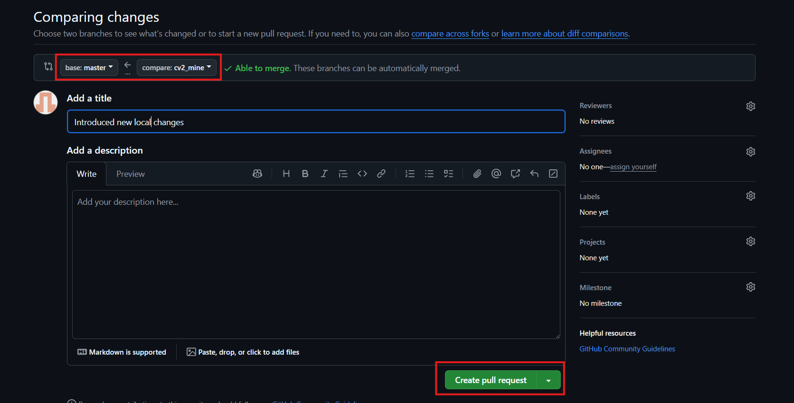

5. Kliknite na **Merge pull request** a potvrďte zlúčenie.

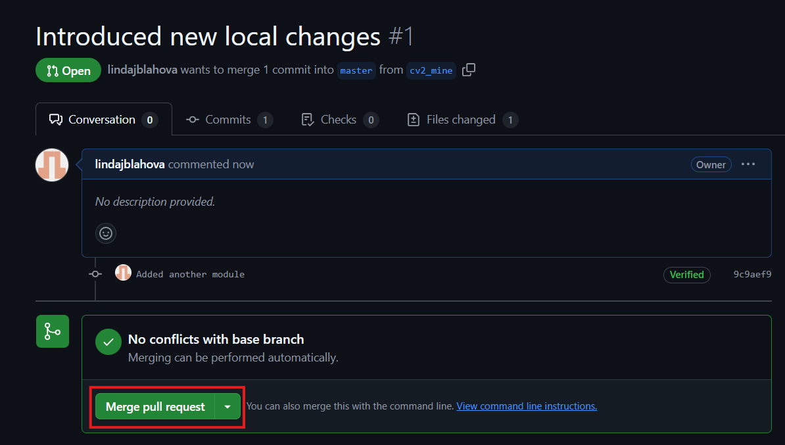

6. Potvrďte merge, zmeny z vetvy sa budú nachádzať už aj v hlavnej vetve. 

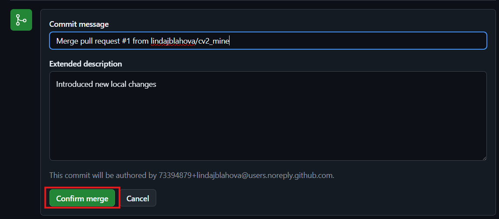
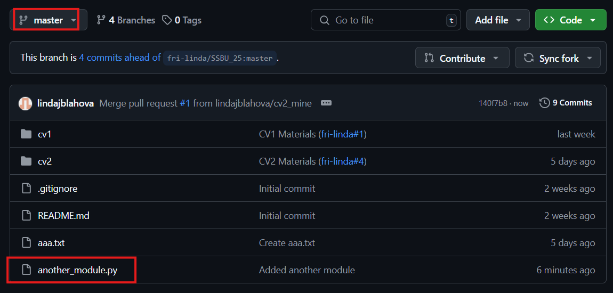

7. Po zlúčení PR môžete vymazať vetvu. (nepovinné)

---

## **3. Synchronizácia s hlavným repozitárom**

Je dôležité synchronizovať svoj fork s hlavným repozitárom **fri-linda/SSBU_25**, aby ste mali najnovšie zmeny.

### **Príkazový riadok**
```sh
# Pridanie hlavného repozitára ako remote upstream
git remote add upstream https://github.com/fri-linda/SSBU_25.git

# Načítanie najnovších zmien
git fetch upstream

# Aktualizácia hlavnej vetvy
git checkout master
git merge upstream/master

# Push do svojho forknutého repozitára
git push origin master
```

### **PyCharm**
1. **Git** → **Github** → **Sync Fork**
3. Ak je to potrebné, vyberte vetvu `upstream/master` a potvrďte zlúčenie, prípadne vyriešte konflikty (akceptujte svoje zmeny).
4. Pushnite zmeny na GitHub.

### **GitHub web interface**
1. Prejdite do svojho forknutého repozitára.
2. Kliknite na **Sync Fork**.
3. Vyberte zachovanie svojich zmien a potvrďte.
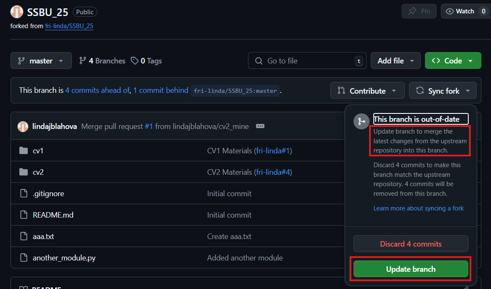
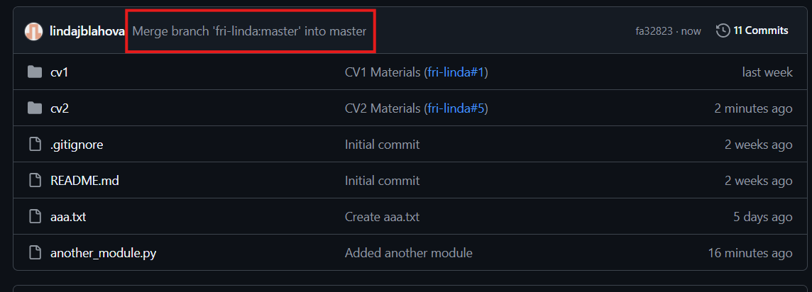

---

## **4. Stiahnutie zmien do lokálneho repozitára**
- Po zlúčení nezabudnite **synchronizovať svoj lokalny repozitar**.

### **Príkazový riadok**
```sh
# Prepnutie na hlavnú vetvu
git checkout master

# Stiahnutie zmien z origin
git pull origin master
```

### **PyCharm**
1. **Názov vetvy** → **Local/master** → **Checkout**.
2. **Master** → **Update Project**.

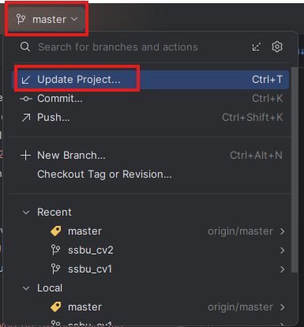

---

### **Zhrnutie**
1. **Vytvorte si novú vetvu.**
2. **Urobte zmeny a commitnite ich.**
3. **Pushnite zmeny do svojho forku.**
4. **Synchronizujte svoj fork s upstream repozitárom.**
5. **Pullnite si zmeny z origin do lokalneho repozitara.**