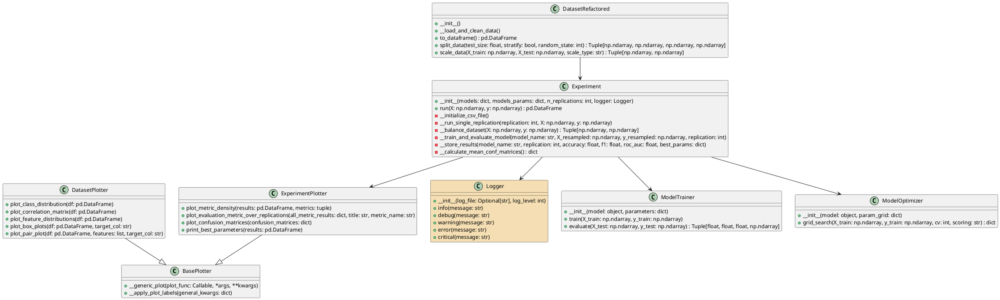
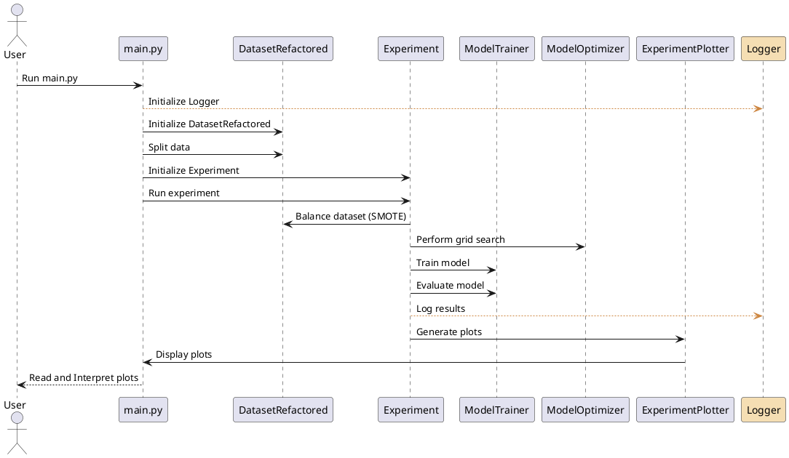

# CV6: Prehľad aplikácie (machine_learning) 

Aplikácia v priečinku `machine_learning` demonštruje použitie strojového učenia na datasete UCI ML Breast Cancer Wisconsin (Diagnostic) z knižnice scikit-learn [1].

Aplikáciu otvorte v programe PyCharm. Pri otváraní aplikácie zvoľte možnosť vytvorenia **nového virtuálneho prostredia**. Ak je potrebná konfigurácia **Python interpretra**, postup nájdete v súbore `CV6_1_Vitrtualne_prostredie.md`.

V hlavnom adresári sa nachádza súbor `requirements.txt`, ktorý obsahuje zoznam knižníc, ktoré je potrebné nainštalovať pred spustením aplikácie.

Adresár **machine_learning** obsahuje hlavný skript `main.py`, ktorý spúšťa analýzu datasetu pomocou strojového učenia. Ďalšie skripty implementujú logiku pre beh experimentov, spracovanie dát, optimalizáciu modelov, vizualizáciu výsledkov a ďalšie.

---

## Prehľad implementovaných tried

### Triedy a ich zodpovednosti:
1. **`DatasetRefactored`**:
   - Načítava a čistí dataset rakoviny prsníka.
   - Rozdeľuje dáta na tréningovú a testovaciu množinu.
   - Škáluje dáta pomocou štandardizácie alebo normalizácie.

2. **`ModelTrainer`**:
   - Trénuje modely strojového učenia na poskytnutých dátach.
   - Vyhodnocuje modely pomocou metrík, ako sú presnosť, F1 skóre a ROC AUC.

3. **`ModelOptimizer`**:
   - Optimalizuje hyperparametre modelov pomocou grid search.

4. **`Experiment`**:
   - Spracováva celý experiment trénovania a hodnotenia modelov.
   - Používa SMOTE na vyváženie datasetu.
   - Ukladá výsledky experimentov a počíta priemerné matice zámien.

5. **`ExperimentPlotter`**:
   - Vizualizuje výsledky experimentov pomocou hustotných grafov, matíc zámien a ďalších vizualizácií.

6. **`Logger`**:
   - Spravuje logovanie správ a výsledkov do konzoly a súborov.

---

## Diagramy aplikácie

### Class Diagram

---

### Call Sequence Diagram

---

## Výstupy aplikácie

Do adresára **outputs** sa ukladajú:
- Logy aplikácie (napr. `application.log`).
- Výsledky experimentov (napr. `model_accuracies.csv`).
- Vizualizácie (napr. grafy hustoty, matice zámien, grafy pre metriky).

---

#### Referencie

[1] https://scikit-learn.org/stable/modules/generated/sklearn.datasets.load_breast_cancer.html